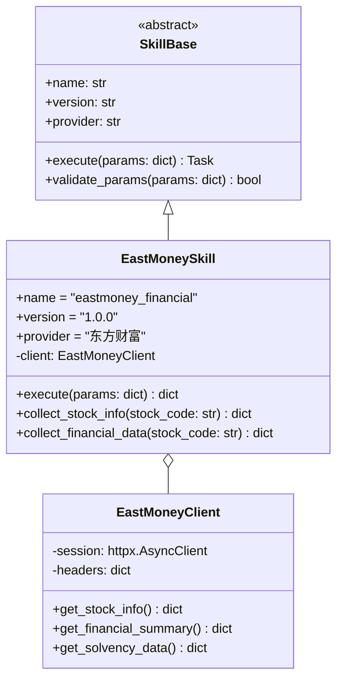
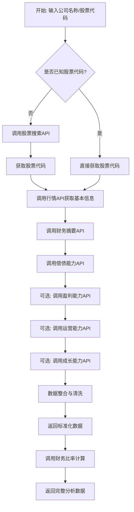
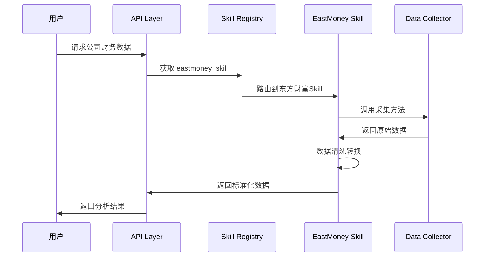

# 东方财富财务数据 Skill 集成方案

## 一、背景与目标

### 1.1 现状分析
当前项目已实现基于东方财富 API 的基础数据采集功能（参见 [`data_collector.py`](backend/app/services/data_collector.py:1)），包含：
- 股票代码搜索
- 公司基本信息
- 财务指标数据
- 估值指标数据

### 1.2 集成目标
将东方财富开放财务数据能力封装为标准 Skill 接口，便于：
- 模块化调用
- 可复用
- 可扩展其他数据源

---

## 二、东方财富开放平台 API 梳理

### 2.1 已对接 API

| API 名称 | 端点 | 获取数据 | 状态 |
|---------|------|---------|------|
| 股票搜索 | `searchapi.eastmoney.com/api/suggest/get` | 股票代码 | ✅ 已实现 |
| 行情数据 | `push2.eastmoney.com/api/qt/stock/get` | 市值、PE、PB | ✅ 已实现 |
| 财务摘要 | `emweb.eastmoney.com/PC_HSF10/NewFinanceAnalysis/ZYZBAjaxNew` | 总资产、总负债、净资产 | ✅ 已实现 |
| 偿债能力 | `emweb.eastmoney.com/PC_HSF10/NewFinanceAnalysis/CzjlAjaxNew` | 流动比率、速动比率 | ✅ 已实现 |

### 2.2 待扩展 API（可选）

| API 名称 | 端点 | 获取数据 | 说明 |
|---------|------|---------|------|
| 盈利能力 | `emweb.eastmoney.com/PC_HSF10/NewFinanceAnalysis/YlnlAjaxNew` | 毛利率、净利率、ROE | 盈利能力指标 |
| 运营能力 | `emweb.eastmoney.com/PC_HSF10/NewFinanceAnalysis/YynlAjaxNew` | 存货周转率、应收账款周转率 | 运营效率指标 |
| 成长能力 | `emweb.eastmoney.com/PC_HSF10/NewFinanceAnalysis/CzntAjaxNew` | 营收增长率、利润增长率 | 成长性指标 |
| 现金流量 | `emweb.eastmoney.com/PC_HSF10/NewFinanceAnalysis/XjllAjaxNew` | 经营/投资/融资现金流 | 现金流数据 |

---

## 三、Skill 架构设计

### 3.1 Skill 目录结构

```
backend/skills/
├── __init__.py
├── base.py              # Skill 基类定义
├── eastmoney/           # 东方财富 Skill
│   ├── __init__.py
│   ├── config.py        # 配置管理
│   ├── client.py        # API 客户端
│   ├──财务_collector.py # 财务数据采集
│   ├── 估值_collector.py # 估值数据采集
│   ├── 行情_collector.py # 行情数据采集
│   └── schemas.py       # 数据模型
└── registry.py          # Skill 注册中心
```

### 3.2 Skill 基类设计



---

## 四、集成流程设计

### 4.1 数据采集流程



### 4.2 Skill 调用流程



---

## 五、数据模型设计

### 5.1 财务数据 Schema

| 字段 | 类型 | 说明 |
|-----|------|------|
| `stock_code` | string | 股票代码 |
| `company_name` | string | 公司名称 |
| `exchange` | string | 交易所 (SH/SZ) |
| `industry` | string | 所属行业 |
| `revenue` | float | 营业收入 |
| `net_profit` | float | 净利润 |
| `gross_margin` | float | 毛利率 |
| `net_margin` | float | 净利率 |
| `roe` | float | 净资产收益率 |
| `roa` | float | 总资产收益率 |
| `total_assets` | float | 总资产 |
| `total_liabilities` | float | 总负债 |
| `equity` | float | 股东权益 |
| `asset_liability_ratio` | float | 资产负债率 |
| `debt_to_equity` | float | 负债权益比 |
| `current_ratio` | float | 流动比率 |
| `quick_ratio` | float | 速动比率 |
| `market_cap` | float | 总市值 |
| `pe_ratio` | float | 市盈率 |
| `pb_ratio` | float | 市净率 |
| `ps_ratio` | float | 市销率 |
| `data_source` | string | 数据来源 |
| `data_date` | string | 数据日期 |

---

## 六、实施步骤

### 6.1 第一阶段：基础框架搭建

1. 创建 `backend/skills/` 目录结构
2. 实现 Skill 基类 ([`base.py`](backend/skills/base.py))
3. 实现 Skill 注册中心 ([`registry.py`](backend/skills/registry.py))

### 6.2 第二阶段：东方财富 Skill 开发

4. 创建东方财富配置管理 ([`eastmoney/config.py`](backend/skills/eastmoney/config.py))
5. 实现 API 客户端 ([`eastmoney/client.py`](backend/skills/eastmoney/client.py))
6. 实现财务数据采集 ([`eastmoney/财务_collector.py`](backend/skills/eastmoney/财务_collector.py))
7. 实现数据模型 ([`eastmoney/schemas.py`](backend/skills/eastmoney/schemas.py))

### 6.3 第三阶段：集成与测试

8. 将现有 DataCollector 逻辑迁移到 Skill
9. 编写单元测试
10. 集成测试验证

---

## 七、接口定义

### 7.1 Skill 执行接口

```python
class EastMoneySkill:
    async def execute(
        self,
        action: str,           # 操作类型: "search", "info", "financial", "all"
        company_name: str = None,
        stock_code: str = None
    ) -> dict:
        """
        执行东方财富数据采集
        
        参数:
            action: 操作类型
                - "search": 搜索股票代码
                - "info": 获取基本信息
                - "financial": 获取财务数据
                - "all": 获取全部数据
            company_name: 公司名称
            stock_code: 股票代码
        
        返回:
            dict: 标准化数据字典
        """
```

### 7.2 返回数据格式

```json
{
    "success": true,
    "data": {
        "stock_code": "600089",
        "company_name": "特变电工",
        "exchange": "SH",
        "revenue": 98206312076.52,
        "net_profit": 10728327630.92,
        "roe": 17.85,
        "pe_ratio": 8.92,
        "pb_ratio": 1.56,
        "data_source": "eastmoney",
        "data_date": "2026-03-24"
    },
    "error": null
}
```

---

## 八、注意事项

1. **错误处理**: API 调用需要完善的异常捕获和重试机制
2. **速率限制**: 东方财富 API 有访问频率限制，需实现限流
3. **数据缓存**: 考虑对频繁访问的数据进行缓存
4. **字段映射**: 东方财富 API 字段名与标准字段名需要映射表
