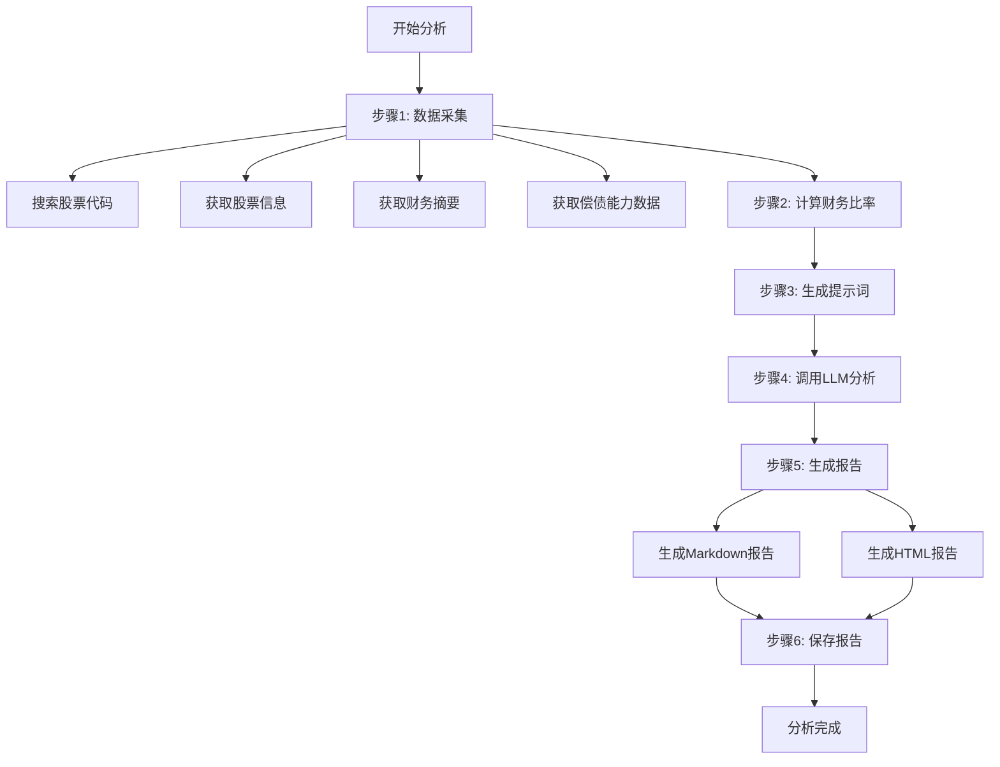

# 特变电工完整分析流程测试用例

## 概述

本测试用例用于测试对"特变电工"（股票代码：600089）进行完整的投资分析流程。

## 测试目标公司

- **公司名称**：特变电工
- **股票代码**：600089
- **交易所**：上海证券交易所（SH）
- **所属行业**：电气设备/新能源

## 完整分析流程

## 数据采集详情

### 1. 搜索股票代码
- API: `https://searchapi.eastmoney.com/api/suggest/get`
- 参数: `input=特变电工, type=14, count=5`
- 预期返回: 股票代码 600089

### 2. 股票基本信息
- API: `https://push2.eastmoney.com/api/qt/stock/get`
- 获取: 市值、市盈率、市净率

### 3. 财务摘要数据
- API: `https://emweb.eastmoney.com/PC_HSF10/NewFinanceAnalysis/ZYZBAjaxNew`
- 获取: 总资产、总负债、股东权益、资产负债率

### 4. 偿债能力数据
- API: `https://emweb.eastmoney.com/PC_HSF10/NewFinanceAnalysis/CzjlAjaxNew`
- 获取: 流动比率、速动比率

## 财务比率计算

| 比率类型 | 指标名称 | 计算公式 |
|---------|---------|---------|
| 盈利能力 | 毛利率 | 直接获取 |
| 盈利能力 | 净利率 | 净利润 / 营业收入 × 100 |
| 盈利能力 | ROE | 直接获取或净利润 / 股东权益 × 100 |
| 盈利能力 | ROA | 净利润 / 总资产 × 100 |
| 财务结构 | 负债权益比 | 总负债 / 股东权益 × 100 |
| 财务结构 | 资产负债率 | 总负债 / 总资产 × 100 |
| 偿债能力 | 流动比率 | 流动资产 / 流动负债 |
| 偿债能力 | 速动比率 | (流动资产 - 存货) / 流动负债 |
| 现金流 | 经营现金流/净利润 | 经营现金流 / 净利润 × 100 |

## 报告输出

### Markdown 报告结构
1. 公司基本信息概览
2. 核心财务数据表格
3. 三维合一分析内容
4. 综合评级与投资建议
5. 风险提示
6. 数据来源信息

### HTML 报告特点
- 响应式设计
- 包含 Chart.js 图表
- 专业的视觉样式
- 可打印格式