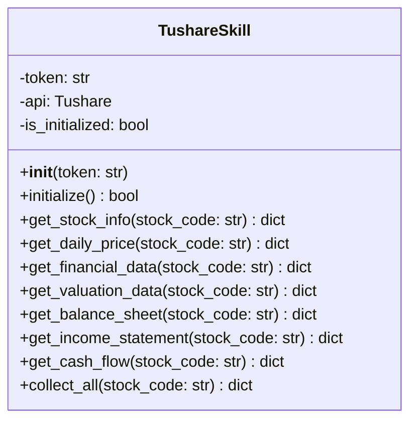

# Tushare 数据采集 Skill 集成方案

## 一、背景与目标

### 1.1 需求背景
用户需要在智能投资分析师项目中集成标准化的数据采集 Skill。由于东方财富妙想开放平台仅支持 OpenClaw 平台使用，无法通过 API 调用，故采用 **Tushare** 作为替代方案。

### 1.2 Tushare 简介
Tushare 是国内领先的金融数据平台，提供：
- 股票、期货、基金等全品类数据
- Python SDK 安装即用
- 免费版有基础数据，高级数据需积分
- Pro 版本有官方 API Key 认证

### 1.3 集成目标
- 封装 Tushare 为标准 Skill 接口
- 支持免费版和 Pro 版切换
- 提供财务数据、估值指标、行情数据等采集能力
- 便于后续扩展多数据源

---

## 二、技术架构

### 2.1 目录结构

```
backend/skills/
├── __init__.py              # Skill 包导出
└── tushare_skill.py         # Tushare 数据采集 Skill
```

### 2.2 Skill 类设计



---

## 三、数据采集能力

### 3.1 免费版可用接口

| 接口 | 功能 | 数据内容 |
|-----|------|---------|
| `stock_basic` | 股票基本信息 | 代码、名称、行业、上市日期 |
| `daily` | 每日行情 | OHLCV、价格、成交量 |
| `daily_basic` | 每日指标 | PE、PB、PS、市值 |
| `financial_data` | 财务指标 | ROE、毛利率、资产负债率等 |

### 3.2 Pro 版扩展接口

| 接口 | 功能 | 数据内容 |
|-----|------|---------|
| `balancesheet_vip` | 资产负债表 | 总资产、总负债、股东权益 |
| `income_vip` | 利润表 | 营业收入、净利润、每股收益 |
| `cashflow_vip` | 现金流量表 | 经营/投资/融资现金流 |
| `fina_indicator` | 财务指标 | 完整财务指标体系 |

---

## 四、数据模型

### 4.1 股票基础信息

| 字段 | 类型 | 说明 |
|-----|------|------|
| `stock_code` | string | 股票代码（6位数字） |
| `ts_code` | string | Tushare格式代码（如 600089.SH） |
| `name` | string | 股票名称 |
| `area` | string | 地域 |
| `industry` | string | 所属行业 |
| `market` | string | 市场类型（主板、创业板等） |
| `list_date` | string | 上市日期 |

### 4.2 行情数据

| 字段 | 类型 | 说明 |
|-----|------|------|
| `date` | string | 交易日期 |
| `open` | float | 开盘价 |
| `high` | float | 最高价 |
| `low` | float | 最低价 |
| `close` | float | 收盘价 |
| `volume` | float | 成交量（股） |
| `amount` | float | 成交额（元） |

### 4.3 估值指标

| 字段 | 类型 | 说明 |
|-----|------|------|
| `pe` | float | 市盈率 |
| `pb` | float | 市净率 |
| `ps` | float | 市销率 |
| `total_mv` | float | 总市值（万元） |
| `circ_mv` | float | 流通市值（万元） |

### 4.4 财务指标

| 字段 | 类型 | 说明 |
|-----|------|------|
| `roe` | float | 净资产收益率 |
| `net_profit_ratio` | float | 净利率 |
| `gross_profit_rate` | float | 毛利率 |
| `roa` | float | 总资产收益率 |
| `eps` | float | 每股收益 |
| `current_ratio` | float | 流动比率 |
| `quick_ratio` | float | 速动比率 |
| `inventory_turnover` | float | 存货周转率 |
| `total_asset_turnover` | float | 总资产周转率 |

---

## 五、使用示例

### 5.1 基本使用

```python
from skills import get_tushare_skill

# 初始化 Skill（免费版不需要 token）
skill = await get_tushare_skill()

# 采集特变电工(600089)全部数据
data = await skill.collect_all("600089")

print(data)
```

### 5.2 分步调用

```python
# 获取股票基本信息
stock_info = await skill.get_stock_info("600089")

# 获取每日行情
daily_price = await skill.get_daily_price("600089")

# 获取估值数据
valuation = await skill.get_valuation_data("600089")

# 获取财务指标
financial = await skill.get_financial_data("600089")

# 获取财务报表
balance_sheet = await skill.get_balance_sheet("600089")
income = await skill.get_income_statement("600089")
cash_flow = await skill.get_cash_flow("600089")
```

### 5.3 Pro 版使用

```python
# 使用 Pro Token
skill = await get_tushare_skill(token="your_pro_token_here")

# Pro 版可以获取更完整的数据
data = await skill.collect_all("600089")
```

---

## 六、配置说明

### 6.1 环境变量

在 `.env` 文件中配置：

```env
# Tushare Pro API Token（可选）
TUSHARE_TOKEN=your_token_here
```

### 6.2 依赖安装

```bash
pip install tushare==1.4.0
```

---

## 七、实施步骤

### 7.1 已完成

- [x] 创建 `backend/skills/` 目录结构
- [x] 实现 `TushareSkill` 类 ([`tushare_skill.py`](backend/skills/tushare_skill.py))
- [x] 添加 `tushare` 到依赖 ([`requirements.txt`](backend/requirements.txt:29))

### 7.2 待完成

- [ ] 创建 Skill 注册中心 (统一管理多数据源)
- [ ] 编写单元测试
- [ ] 集成测试验证
- [ ] 更新现有 DataCollector 迁移文档

---

## 八、Tushare vs 东方财富对比

| 特性 | Tushare | 东方财富爬虫 |
|-----|---------|-------------|
| 认证方式 | API Key | 无（爬虫） |
| 数据稳定性 | 高（官方API） | 中（可能受限） |
| 免费数据 | 基础数据 | 较全 |
| 数据完整性 | Pro版更全 | 较全 |
| 合规性 | 合规 | 存在风险 |
| 积分机制 | 有（限制调用频率） | 无 |

---

## 九、注意事项

1. **免费版限制**：部分财务接口需要较高积分，免费版可能无法访问
2. **调用频率**：Tushare 有接口调用频率限制，需注意节流
3. **数据缓存**：建议对频繁访问的数据进行缓存
4. **错误处理**：网络异常时需有重试机制

---

## 十、申请 Tushare Pro

如需更完整的数据，可以申请 Tushare Pro：

1. 访问 https://tushare.pro/
2. 注册账号
3. 申请 API Token
4. 在代码中设置 token

免费版虽然功能受限，但对于基础分析已经足够。
